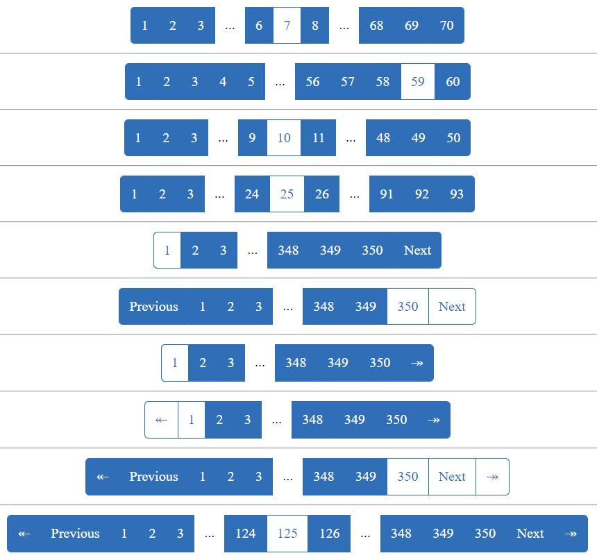
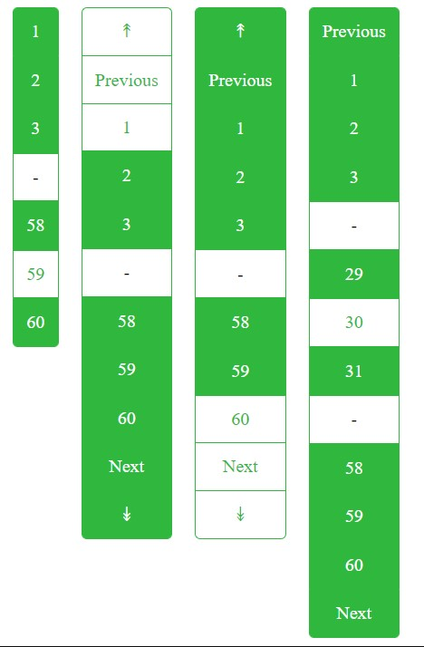

# Pagination API for PHP




#Installation

```
composer require neutronstars/pagination
```
```json
{
  "require": {
    "neutronstars/pagination": ">=1.0.0"
  }
}
```

#Example

```php
<?php
  require_once __DIR__.DIRECTORY_SEPARATOR.'..'.DIRECTORY_SEPARATOR.'vendor'.DIRECTORY_SEPARATOR.'autoload.php';
  use NeutronStars\Pagination\Pagination;
  
  $currentPage = 1;
  $itemPerPage = 10;
  $totalItem = 200;
  echo new Pagination($currentPage, $itemPerPage, $totalItem);

```

#Options

```php
<?php
  require_once __DIR__.DIRECTORY_SEPARATOR.'..'.DIRECTORY_SEPARATOR.'vendor'.DIRECTORY_SEPARATOR.'autoload.php';
  use NeutronStars\Pagination\Pagination;

  $options = [
     'range'         => 3,
     'key'           => ':page',
     'url'           => '?page=:page',
     'build-empty'   => false,
     'previous-next' => [
       'active'           => false,
       'next-content'     => 'Next',
       'previous-content' => 'Previous',
       'hidden'           => true
     ],
     'first-last'    => [
       'active'        => false,
       'first-content' => '«',
       'last-content'  => '»',
       'hidden'        => true
     ],
     'css'           => [
        'parent-class'               => 'pagination',
        'child-class'                => 'pagination-item',
        'child-class-active'         => 'pagination-item-active',
        'separator-class'            => 'pagination-separator',
        'separator-content'          => '...',
        'previous-next-class'        => 'pagination-pn-item',
        'previous-next-class-active' => 'pagination-pn-item-active',
        'first-last-class'           => 'pagination-fl-item',
        'first-last-class-active'    => 'pagination-fl-item-active'
     ]
  ];

  $currentPage = 1;
  $itemPerPage = 10;
  $totalItem = 200;
  echo new Pagination($currentPage, $itemPerPage, $totalItem, $options);
```
